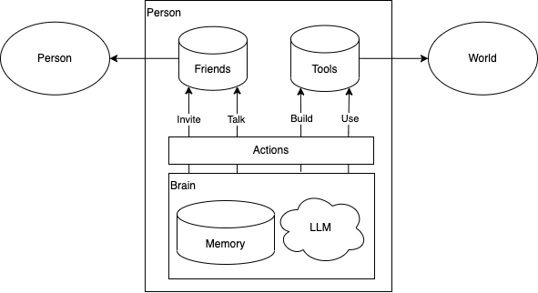
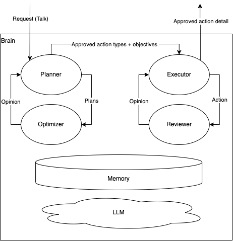
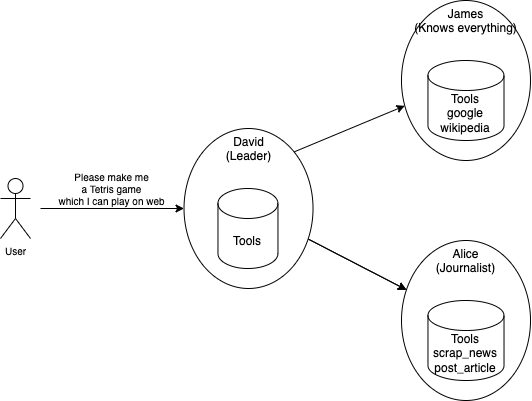
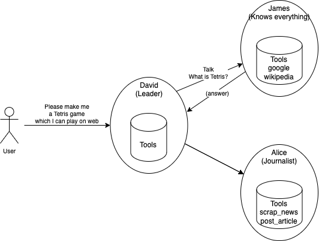
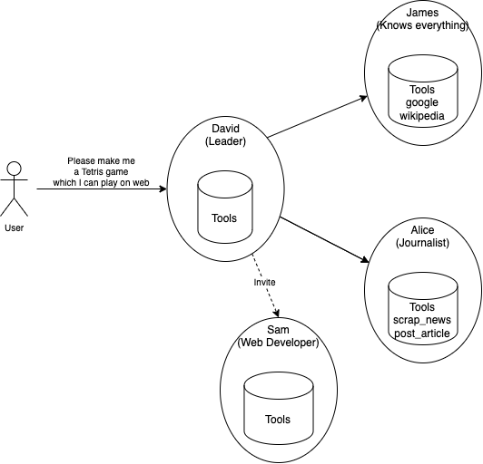
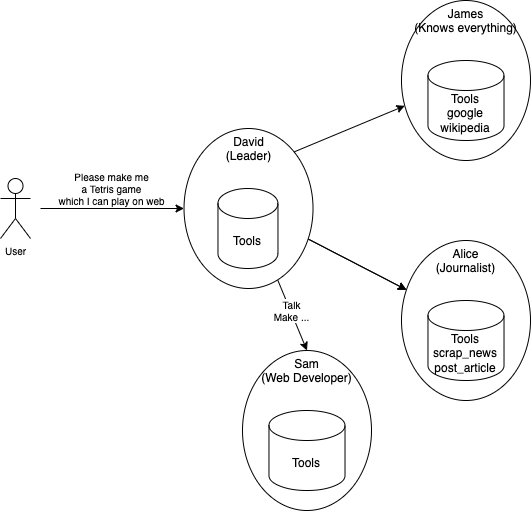
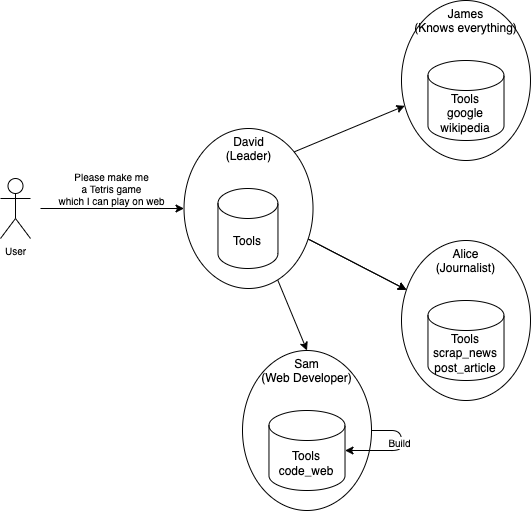
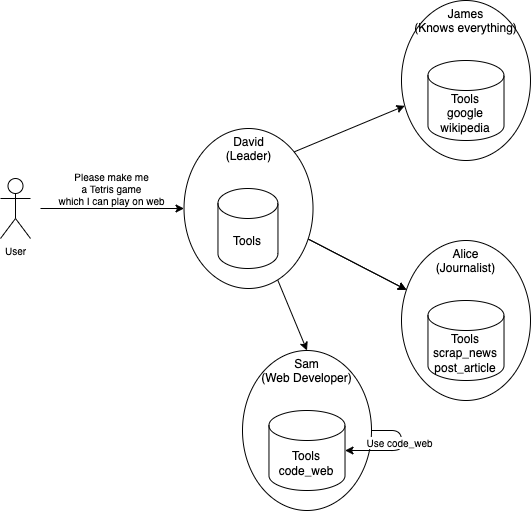
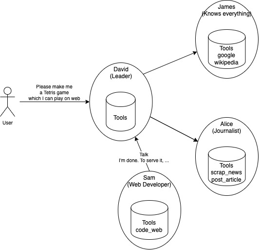

# AIvilization (Artificial Civilization)

### Quick Start

Set `.env`.

```ini
OPENAI_API_KEY=sk-EXAMPLE
PINECONE_API_KEY=ad3787cc-EXAMPLE
LOG_LEVEL=DEBUG
```

Run this command.

```
poetry install
poetry run start
```

## Structure

### Person



Here's the brief diagram of the `Person`. It consists of a `Brain`, `Friends` (list of `Person`) and `Tools` (list of `Tool`). `Person` can take one of 4 actions: invite, talk, build and use. `Brain` determines which action to take and provides parameters for the action.

- Invite
  - Invite a new person to the civilization and be friends with them.
  - When a person invites another, they gives them a personality and tools.
- Talk
  - Talk to a friend.
  - They can ask something to do, notice something, or just talk.
- Build
  - Build a new tool.
  - Code something as a tool.
- Use
  - Use a tool.

### Brain



`Brain` consists of `Organize`, `Memory` and `LLM`. `Organize` is basically a prompt formatter. It makes a prompt for the `LLM` input. There are 4 kinds of `Organize` in a `Brain`: `Planner`, `Optimizer`, `Executor` and `Reviewer`. `Planner` generates plans, which is a list of action types and objectives. `Optimizer` checks the plans and determines to approve or reject them. If they're rejected, `Planner` makes new plans, reflecting the `Optimizer`'s opinion. After approval of the plans, `Executor` makes detailed parameters of the actions. Once these are approved by `Reviewer`, they are executed in deterministic manner, while the plans from `Planner` is abstract and undeterministic.

`Memory` and `LLM` are used through out this whole process.

### Civilization

There are two persons in the civilization initially. One is the leader, and the other is user. The user talks to the leader, with UI (CLI prompt is available currently). The leader will invite a new person if it's necessary. Participants can talk to each other, build tools and use them. This process is repeated recursively until the leader reponds to the user with the final answer.

Here's a simple example.









